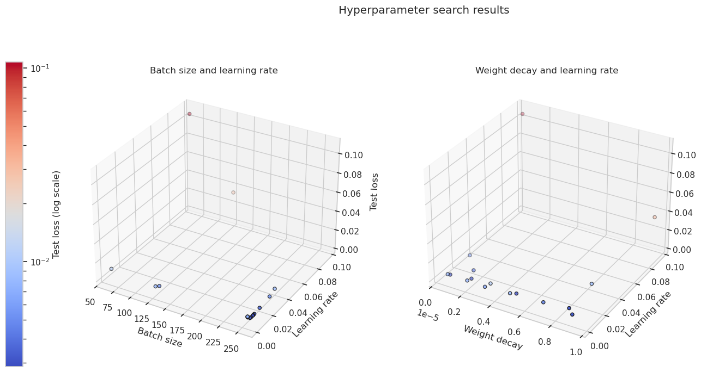
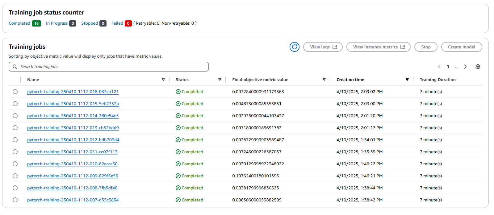
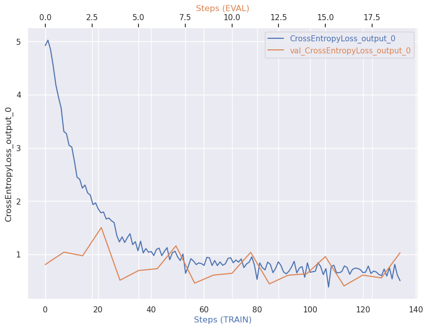
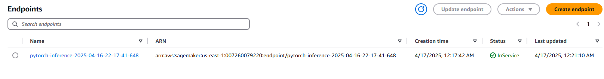

# Dog breed classification

This project is about training and deploying a model which can classify a dog breed for a given image.

I use SageMaker AI Script mode with a pre-trained model to fine-tune, train and deploy the model.

[//]: # (## Project Set Up and Installation)
[//]: # (**OPTIONAL:** If your project has any special installation steps, this is where you should put it. To turn this project into a professional portfolio project, you are encouraged to make your `README` detailed and self-explanatory. For instance, here you could explain how to set up your project in AWS and provide helpful screenshots of the process.)

## Dataset

### Overview
The dataset consists of .jpg images belonging to images of 133 different dog breeds.
The dataset is already divided into training, validation and test sets.
There is:
* 6680 samples in the training set,
* 835 samples in the validation set,
* 836 samples in the test set.

The dataset is hosted by Udacity as a zipped archive in S3 bucket:
[dogImages.zip](https://s3-us-west-1.amazonaws.com/udacity-aind/dog-project/dogImages.zip).

Some more information about the dataset can be found in 
[train_and_deploy.ipynb](train_and_deploy.ipynb), section **Dataset**.

### Access
I downloaded the zipped dataset, extracted it and uploaded to mine S3 bucket.
I pass them to the script by `sagemaker.session.TrainingInput`:
```python
tuner.fit(
    {
        "training": TrainingInput(f"{dataset_prefix}/train/", distribution="FullyReplicated"),
        "test": TrainingInput(f"{dataset_prefix}/valid/", distribution="FullyReplicated"),
    },
)
```

## Hyperparameter Tuning

I chose a pretrained ResNet50, with one fully connected layer top. Only the last fully connected layer is trained.
I trained the model with the [Adam optimizer](https://pytorch.org/docs/stable/generated/torch.optim.Adam.html).
I decided to tune these three parameters:
* learning rate
* weight decay
* batch size

The `learning rate` defines the initial speed of training (when using Adam).
The default value  is 0.001. I tried a range of values from 0.001 to 0.1. 

`weight decay` (also called [L2 penalty](https://en.wikipedia.org/wiki/Regularization_(mathematics)))
helps in preventing overfitting.
But because I train only one linear layer (the ResNet weights are frozen) I don't want this penalty to be too big,
to not shrink my weights towards 0. That's why a tried a range of values from 0 to only $10-5$.

The last parameter I tune is `batch size`.
I try values 64, 128 and 256. 
I don't want to use values smaller than 64, because the usage of the GPU machine costs money
and smaller batches would underutilize the GPU. 
I don't try larger values than 256 because I thought that it might not fit on the cheapest GPU machine I use here.

I train each model for 5 epochs.
The number of epochs could also be tuned.
However, I don't want to let the model run for too long - again for money constraint. 
I run 16 different training jobs, so that it has a chance to try different combinations of 
`learning rate`, `weight decay` and `batch size`.
I train each model on "ml.g4dn.xlarge" machine, which I found to be the cheapest EC2 instance with GPU 
(see [pricing](https://aws.amazon.com/sagemaker-ai/pricing/)).
As I will see after the tuning job is completed, each individual job takes around 7 minutes.

I plotted the results of the tuning job.
The two graphs below shows the relationship of the validation loss against
the three parameters:

<td align="center">
  <br>
  <em>
    The validation loss against `learning rate`, `batch size` and `weight-decay`. 
  </em>
</td>

The best job achieved 0.002873 validation loss, with 
`learning rate`: 0.007304, `batch size`: 256 and `weight decay`: 0.000005.

The figure below shows the completed, individual jobs of the hyperparameter tuning.

<td align="center">
  <br>
  <em>
    The completed jobs of the hyperparameter tuning.
  </em>
</td>

## Debugging and Profiling
I set up two debugging rules: `loss_not_decreasing` and `vanishing_gradient`. 
Because there are only 6680 training samples and I train with the batch size 256, 
I set the save interval of `loss_not_decreasing` to 1 and `vanishing_gradient` to 5, 
so that the rules have enough samples to use.

I also added two Profiler rules: `LowGPUUtilization` and `ProfilerReport`

### Results
Neither `loss_not_decreasing` nor `vanishing_gradient` raised any warnings. 
Below I plot the training versus validation loss. 
It shows that the loss is gradually decreasing.
But it doesn't yet overfit, because the train and validation loss are very similar.
It would be problematic if the training loss was decreasing, but the test loss increasing.

<td align="center">
  <br>
  <em>Train versus test cross entropy loss of the final model.</em>
</td>

The profiler report shows there are no problems except for **Low GPU utilization**.
This is surprising to me because I thought that the batch size of 256 is already big.
However, the profiler report advices to increase the batch size:
>> Your training job is underutilizing the instance. You may want to consider to either switch to a smaller instance 
> type or to increase the batch size. The last time that the LowGPUUtilization rule was triggered in your training job
> was on 04/16/2025 at 12:50:00. The following boxplots are a snapshot from the timestamps.
> They show the utilization per GPU (without outliers). To get a better understanding of the workloads throughout the
> whole training, you can check the workload histogram in the next section.

## Model Deployment

Following the advice from [this thread](https://knowledge.udacity.com/questions/903805) on the Udacity forum,
I copied the starter pack from the Project 4 and created the [`inference.py`](inference.py) script with these 3 functions:
```python
model_fn()
input_fn()
predict_fn()
```

I also based creating the `ImagePredictor` and `PyTorchModel` classes on the Project 4 starter pack.

I deployed my model on a single instance of `ml.m5.large`.

In order to send an image to the endpoint, you need to read the image with `PIL.Image.open()`
and transform the image into bytes array. 
I prepared a function to do it:
```python
def image_to_bytes_array(img):
    imgByteArr = io.BytesIO()
    img.save(imgByteArr, format=img.format)
    imgByteArr = imgByteArr.getvalue()
    return imgByteArr
```

Then, to invoke the endpoint:
```python
image_path = "./dogImages/test/046.Cavalier_king_charles_spaniel/Cavalier_king_charles_spaniel_03294.jpg"
image = Image.open(image_path)

response = predictor.predict(image_to_bytes_array(image), initial_args={"ContentType": "image/jpeg"})
```

Below you can see the evidence that I deployed the endpoint:
<td align="center">
  <br>
  <em>Deployed active endpoint in the SageMaker.</em>
</td>

## Standout Suggestions
**TODO (Optional):** This is where you can provide information about any standout suggestions that you have attempted.
